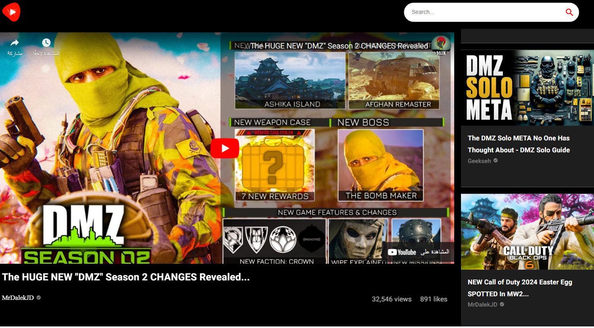

# Youtube Clone 
Youtube Clone is a video-sharing for watching and sharing videos and it is v3 from Youtube built with react and mui, rapidapi. With Modern design, animations and showing the number of views and likes related with videos.

 
 

 

## Live Site:  
   - Link: https://youtubeclone1123.netlify.app/

## Features
  - Advanced React Best Practices such as
    - Folder and file structure, hooks and refs
  - Advanced State Management of the entire application using React Context API
  - Search Component: search the kind of exercise and showing you all exerxises have to do
  - Video Details: this component showing Video details like watching video and showing related videos.
  - Use Material-UI: Is an open-source React component used to build the structer of the component.
   - Responsevie Layout: use media queries for all screens to make app responseve

## Technologies
Project is created with:
   - React.Js
   - React Hooks (useState, useEffect)
   - API (RapidAPI)
   - Material-UI
   - Responsevie Layout

